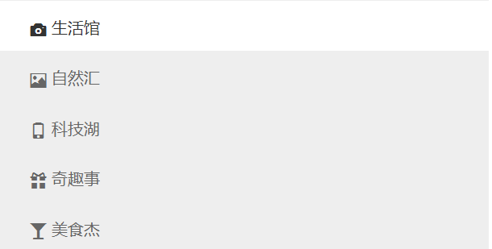

# 响应式




希望上图在页面变小的时候，能够浮动起来在一行显示


```
/* 当我们进入 小屏幕 还有 超小屏幕的时候 我们 nav 里面的li 浮动起来 并且宽度为 20%  */

@media screen and (max-width: 991px) {
    .nav li {
        float: left;
        width: 20%;
    }
    article {
        margin-top: 10px;
    }
}

```

