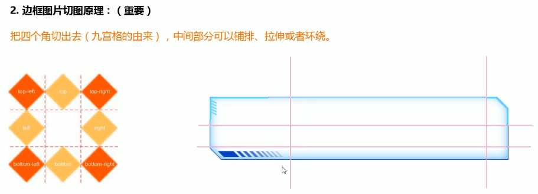

# 图片

## logo

有些logo是白色的，在网页上显示不出来，给它添加一个背景色就好了；

拖动窗口时，如果图片的宽度是 `width: 100%;`会导致图片缩放;

若需要取消图片缩放，设置 `max-width: 100%;`

图片居中:

> 块元素才能设置margin

```
display: block;
margin: 0 auto;
```

进入超小屏幕后，logo内的图片隐藏起来：

```

```

图片不见后，出现文字；该文字只在超小屏幕下显示，在其他尺寸的屏幕只显示图片不会显示该文字；

```
<span class="visible-xs">阿里百秀</span> 
```

### url 背景图

```css
background: url(../images/classify.png) no-repeat;
background-size: .5867rem .9333rem;
```

background-size 表示对背景图进行缩放，其后的两个参数 `.5867rem .9333rem`是父盒子的宽和高。


```css
background: url(../images/classify.png) no-repeat;
background-size: cover;
```

连写形式,要连写需要加背景位置 0 0

```css
background: url(../images/classify.png) no-repeat 0 0 / cover;
```

设置 background-size: cover;可让背景图随着窗口尺寸变化进行缩放；


> cover 和 contain的区别？

background-size: contain;


## 边框图片

1. 边框图片使用场景

2. 边框图片的切图原理

3. 边框图片语法规范


使用场景

盒子大小不一，边框样式相同，此时就需要边框图片来完成；

为实现丰富多彩的边框效果，在CSS3中，新增border-image属性，这个新属性允许指定一幅图像作为元素的边框；


边框切图




按照 上右下左 顺序切割


| 属性                  | 描述                                           |
| ------------------- | -------------------------------------------- |
| border-image-source | 用在边框的图片的路径                                   |
| border-image-slice  | 图片边框向内偏移，不加单位                                |
| border-image-width  | 图片边框的宽度 ，需要单位                                |
| border-image-repeat | 图片边框是否应平铺(repeat)、铺满(round)或拉伸(stretch) 默认拉伸 |
