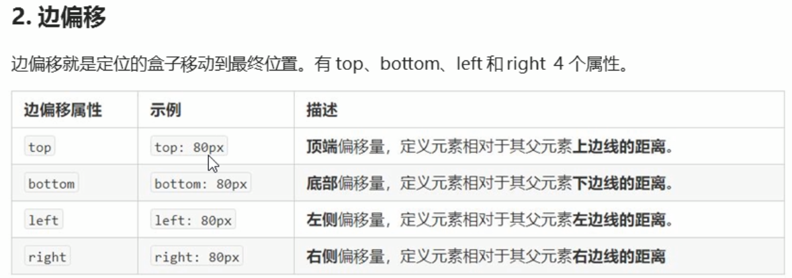

# 定位

## 为什么需要定位

问：

1. 某个元素可自由地在一个盒子内移动位置，并且压住其他盒子；
2. 当我们滚动窗口的时候，盒子固定在某个位置；

比较：

1. 浮动可以让多个块级盒子一行没有缝隙排列显示，经常用于横向排列盒子；
2. 定位可让盒子自由地在某个盒子内移动位置或者固定在屏幕中的某个位置，并且可以压住其他盒子；

## 定位组成

定位：将盒子定在某个位置，故定位也是在摆放盒子，按照定位的方式移动盒子；

定位 = 定位模式 + 边偏移

 定位模式指定一个元素在文档中的定位方式。边偏移则决定了该元素的最终位置。

默认是**静态定位**，static，即标准流；

**相对定位**是元素在移动位置的时候，相对于它原来的位置；

`position : relative;`

1. 相对指的是，相对原来的位置，不是相对父亲；

2. 原来在标准流位置继续占用，后面的盒子仍然以标准流的方式对待它。(不脱标，继续保留原来的位置)

   虽然它走了。但是它的位置还是保留的，它下面的盒子不会去占用它原来的位置；

### **绝对定位**

相对于它祖先元素

`position:absolution`

特点:

1. 若没有祖先元素或者祖先元素没有定位，则以浏览器为准定位

2. 若父元素没有定位，则会去看祖父是否有定位

3. 绝对定位不再占用原来的位置(脱标),底下的盒子会占有它原来的位置

   好处：**在图片上添加元素，不会占用位置**；

   * 浮动也是脱标的，思考一下区别：

     若先给图片，则不能再把元素浮动在该图片上，因为浮动只能影响后面的盒子，不能影响前面的盒子；

     

   

问题：

1. 绝对定位和相对定位的使用场景？
2. 为什么说相对定位给绝对定位当爹？

### 子绝父相的由来

即：子级使用绝对定位，父级使用相对定位

子级绝对定位，不会占有位置，可放在父盒子里面的任何一个地方，不会影响其他兄弟盒子

* 父级元素必须要加定位；不加定位那么子元素会相对于文档定位；
* 父盒子布局，需要占用位置，因此父元素只能是**相对定位**
  * 若父元素加绝对定位；父元素脱标，会影响后面的元素；

注意：偏移可以设为负数；

### 固定定位

* **与父元素没有任何关系，只与可视窗口相关**

  * 不随滚动条滚动

  可视窗口，浏览器当前可以看见的范围；

* 不会占用位置，脱标

  可看成特殊的绝对定位

#### 相对版心固定定位

## 粘性定位

> 不常用 IE不支持，将来的发展方向
>
> 网上类似的效果不是通过粘性定位做的，而是通过js做的

可认为是 相对定位 和 固定定位的混合

定位总结

叠放次序

> 在各个定位的标签中，决定哪个标签在最上面

