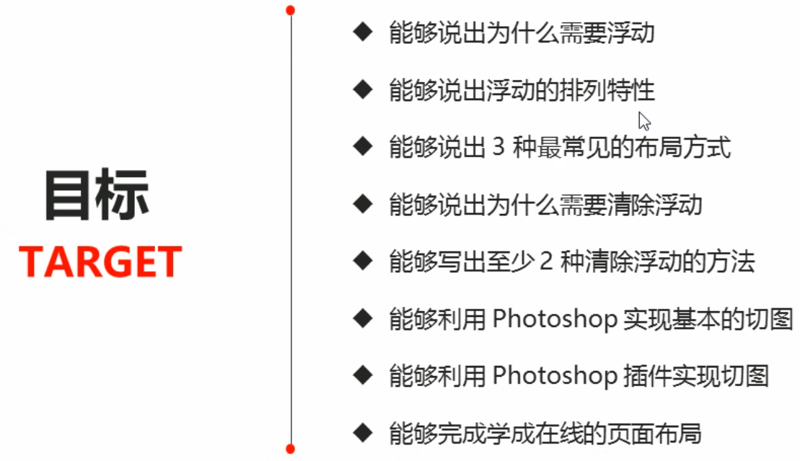
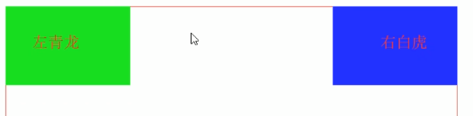

# 浮动




## 传统网页布局三种方式

* 普通流（普通流/文档流）

  标签按照规定好默认方式排列

  

  块级元素,从上到下顺序排列：

  div hr p h1~h6 ul ol dl form table

  

  行内元素，从左到右顺序排列，碰到父元素边缘自动换行:

  span a i em

  

* 浮动

  为什么需要浮动？

  问：

  1.  如何让多个div水平排成一行

     转成行内块后，它们之间有大的**空白缝隙**，难以控制；

  2. 如何实现两个盒子的左右对齐

     

  

  <font color='red'>网页布局第一准则：</font>

  <font color='red'>多个块级元素纵向排列找标准流，多个块级元素横向排列找浮动</font>

   

* 定位


浮动定义：

<font color='red'>float</font>属性用于创建浮动框，将其移动到一边，直到左边缘或右边缘触及包含块或另一个浮动框的边缘；

语法：

> 选择器{ float : 属性值}

| 属性值 | 描述         |
| ------ | ------------ |
| none   | 元素不浮动   |
| left   | 元素向左浮动 |
| right  | 元素向右浮动 |


## 浮动特性

【重难点】：

1. 浮动元素会脱离标准流（脱标）

   脱离标准普通流的控制(浮)移动到指定位置(动)，俗称(脱标)

   浮动的盒子不再保留原先的位置(让其他标准流的盒子占有)

2. 浮动的元素会一行内显示并且元素顶部对齐

3. 浮动元素会具有行内块元素的特性

   任何元素都可以浮动，无论什么模式的元素，添加浮动之后，具有行内块元素相似的特性。

   * 行内元素有了浮动后，无需转换成块级/行内块元素就可以直接给高度和宽度；

   * 可不指定宽度，让其内容自动撑开

   * **浮动的盒子中间没有缝隙**，是紧挨在一起的


浮动元素经常和标准流父级搭配使用

为了约束浮动元素位置，网页布局一半采取的策略：

* **先用标准流的父元素排列上下位置，之后内部子元素采取浮动排列左右位置，符合网页布局第一准则**

  <font color='red'>父元素管上下，浮动管左右</font>

* 大盒子内的一个元素浮动了，理论上其余的兄弟元素也要浮动

  **浮动的盒子，只会压住后面的标准流**

  若希望对此进一步了解，建议浏览[点击](浮动案例.md)

  

<font color='red'>网页布局第二准则：先设置盒子大小，再设置盒子位置</font>


## 清除浮动

### 为何需要清除浮动

如果给父盒子设置高度，在与后端内容交互时，无法提前知道给多少高度；

故浮动的父盒子不设置高度，依靠其内的内容撑开盒子；

浮动的元素不占用高度，父盒子不设置高度，会变成一条线 ，高度塌陷，影响下面标准流的盒子；

解决办法：清除浮动；


### 清除浮动的本质

* 如果父盒子本身有高度，则不需要清除浮动；
* 清除浮动之后，父级就会根据浮动的子盒子自动检测高度。父级有了高度，就不会影响下面的标准流了；


语法:

> 选择器 { clear: 属性值;}

| 属性值 | 描述                                     |
| ------ | ---------------------------------------- |
| left   | 不允许左侧有浮动元素(清除左侧浮动的影响) |
| right  | 不允许右侧有浮动元素(清除右侧浮动的影响) |
| both   | 同时清除左右两侧浮动的影响               |

实际工作中：几乎只用 `clear: both`

<font color='red'>清除浮动的策略是: 闭合浮动</font>


### 清除浮动的方法

1. **额外标签法**，也称隔墙法，w3c推荐的做法；
2. 父级添加overflow属性;
3. 父级添加after伪元素；
4. 父级添加双伪元素；

> 2，3，4 是重点


#### 额外标签法

在浮动元素末尾**添加一个空的标签**，或者其他标签(如 \<br />)

> <!-- 这个新增的盒子要求必须是块级元素不能是行内元素 -->

```html
<style>
    .clear {
            clear: both;
        }
<style>
<div class="box">
        <div class="damao">大毛</div>
        <div class="ermao">二毛</div>
        <div class="clear"></div>
        <!-- 这个新增的盒子要求必须是块级元素不能是行内元素 -->
        <!-- <span class="clear"></span> -->
</div>
<div class="footer"></div>
```

缺点：添加许多无意义标签，结构性差；


#### 父级添加overflow属性

给父级添加**overflow**属性，将其属性值设置为 **hidden, auto, scroll**

扩展：外边距合并也是通过这个解决的问题

缺点：无法显示溢出的部分 ，溢出隐藏，超过的切掉，看不见


#### 父级添加after伪元素

`: after`方式是额外标签法的升级版，也是给父元素添加

> 没有增加额外标签，结构简单；

后续学了伪元素再说


#### 父级添加双伪元素


