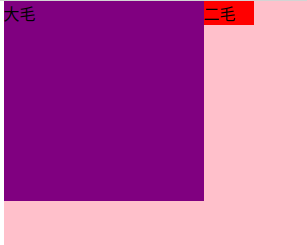
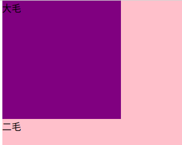
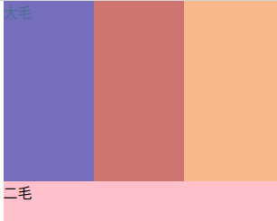
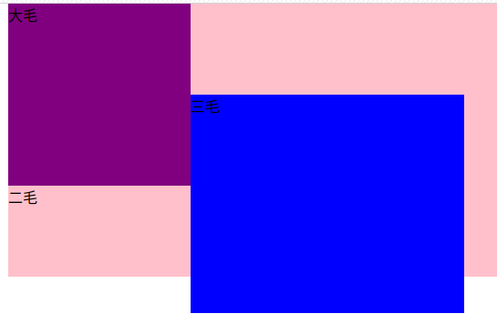
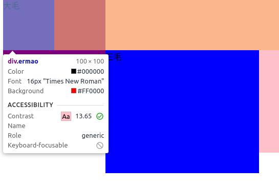

# 浮动 

在一个div中：

* 若第一个盒子有浮动，第二个盒子标准流(无浮动)的情况分析

  

  如上图所示，若第二个盒子的宽度比第一个盒子宽的情况

* 若第二个盒子的宽度比第一个盒子的宽度小

  

  看不到第二个盒子的背景色，但第二个盒子的内容会在下面显示

  

如图是检查模式下视图

[浮动代码](../第六天/diy/15-浮动&不浮动.html)

* 在之前的基础上，添加一个浮动的盒子

  

  

  

  
如图是检查模式下视图

  
  因为第二个盒子是标准流，独占一行；第一个盒子浮动占了左边；故第三个盒子就放在这两个盒子的夹缝中。