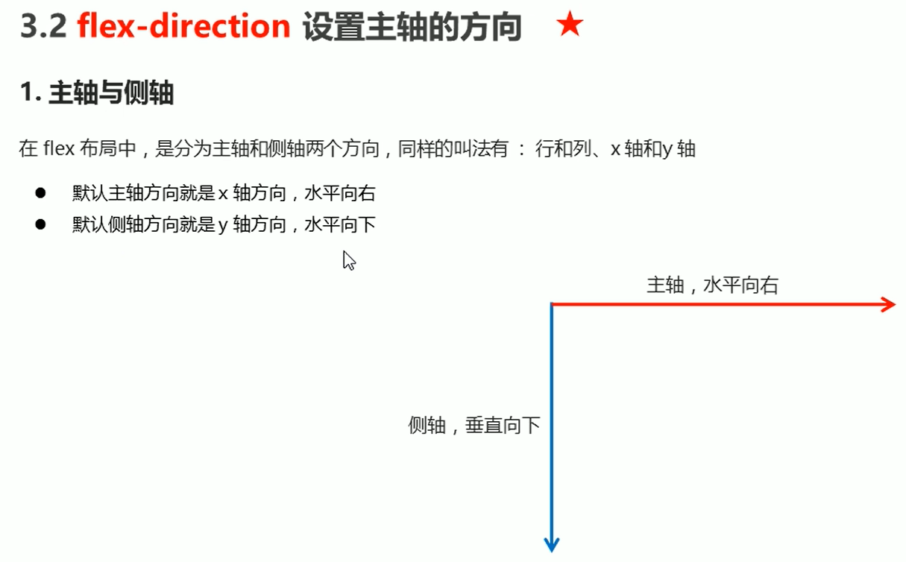
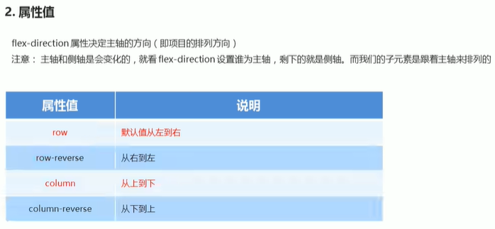
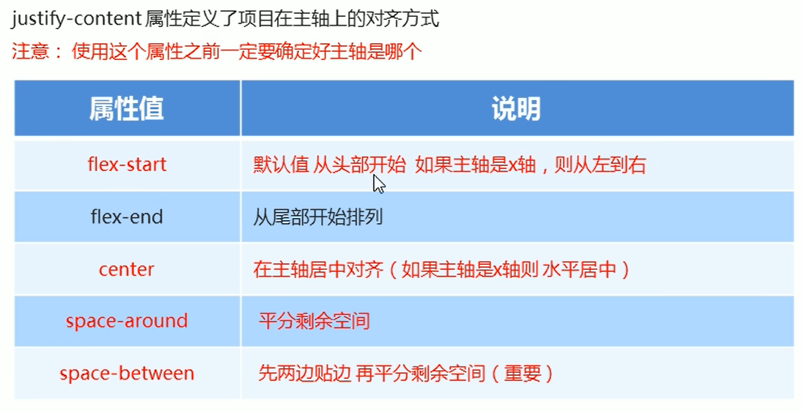

# flex

## 父项常见属性

* flex-direction: 设置主轴方向

  

  

  把主轴设置为y轴
  flex-direction: column;

  

  

  

* justify-content: 设置主轴上的子元素排列方式

* flex-wrap: 设置子元素是否换行

* align-content: 设置侧轴上的子元素的排列方式(多行)

* align-items: 设置侧轴上的子元素排列方式(单行)

* flex-flow: 复合属性，相当于同时设置了 flex-directhion 和 flex-wrap

  ```
  /* 把设置主轴方向和是否换行（换列）简写 */
  flex-flow: column wrap;
  ```


flex:

* 可写 1,2,3 与兄弟节点形成比例关系
* 20%；一行只能放5个
