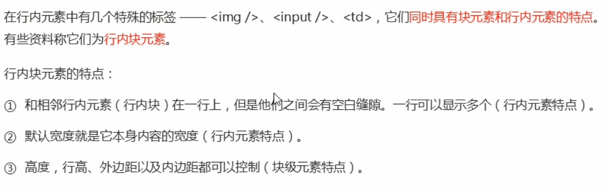
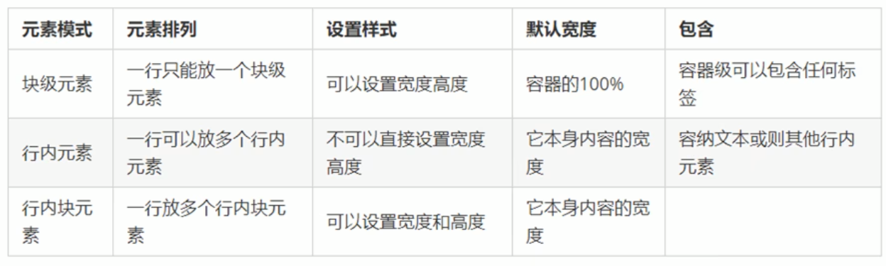
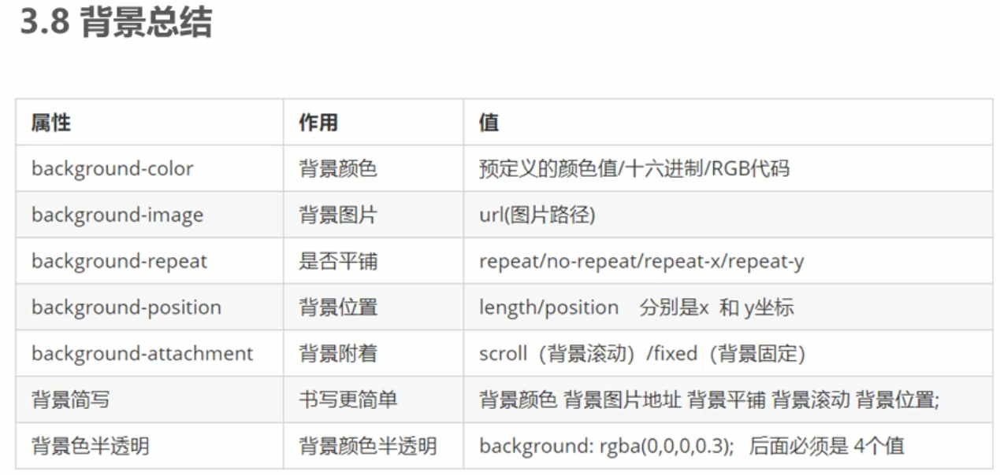
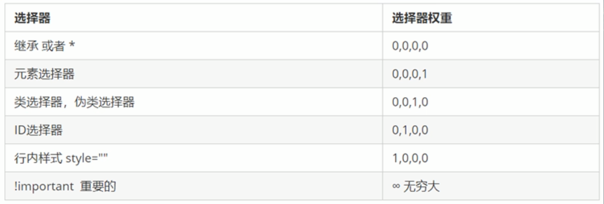
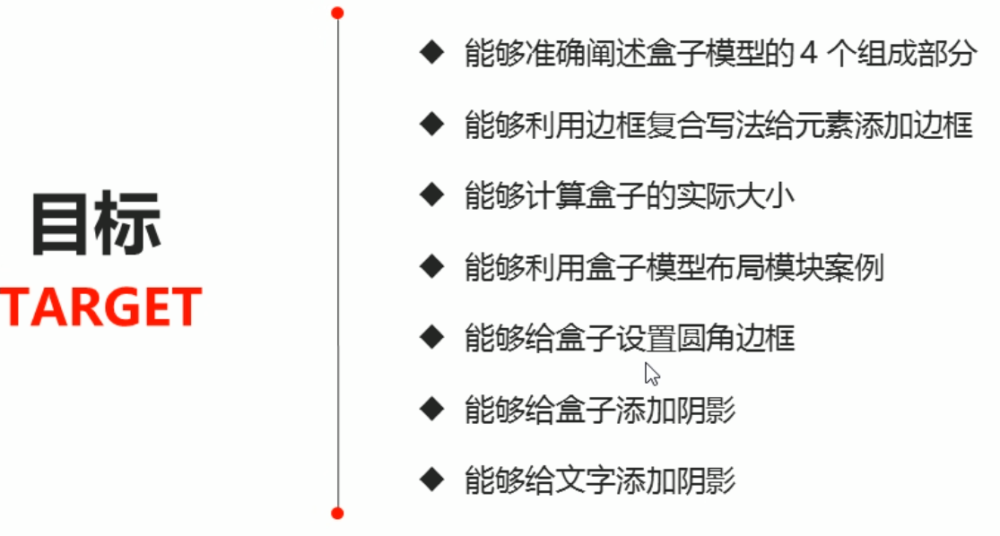
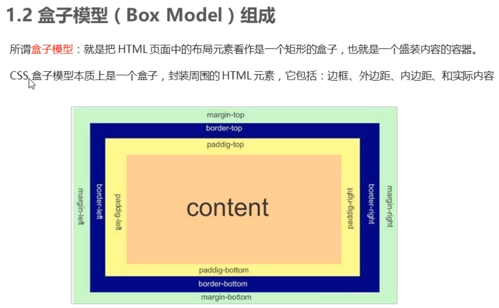
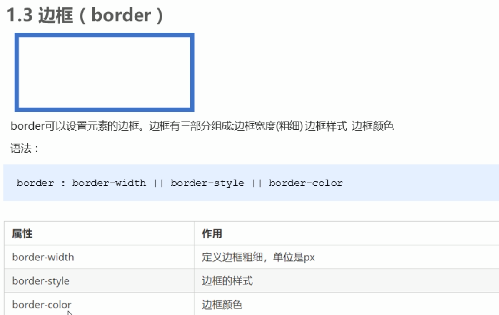

要学习的内容:
* flex布局

plugin：
* open in browser
* js-css-html  formatter
* auto rename tag
* css peek


## 字体

* 垂直居中

  css没有提供垂直居中的代码 [原理](https://www.bilibili.com/video/BV14J4114768?p=114)

  行高和容器高度一致

  ```html
  height: 40px;
  line-height: 40px;
  ```

  

## 第四天

### 行内块元素

> 既能一行放多个，又具有宽和高

img, input, td  它们同时具有块元素和行内元素的特点，称为行内块元素；



行内块元素具有宽和高；**按道理，只有块元素具有宽和高**





==p标签内不允许放div标签==，即 **行内元素**不允许放**块元素**；

a里面可以放块元素


### 元素显示模式的转换

> 一个模式需要另外一种模式的特性


* 转换为块元素：display:block;

* 转换为行元素：display:inline;

* 转换为行内块元素：display:inline-block;

a属于行内元素没有宽度和高度


### 背景

没有特定的顺序，习惯的约定方式为：

background: 背景颜色 背景图片地址 背景平铺 背景图像滚动 背景图片位置





## 第五天


css三个重要特性：层叠性、继承性、优先级

* 层叠性

  相同的选择器设置相同的样式，在样式冲突时

  * ==就近原则==

* 继承性

  子标签会继承父标签

  
  
  颜色和字体相关的都可以继承
  
  font : 12px / 24px ;     文字大小12px，行高24px
  
  font : 12px / 1.5;         行高不跟单位，表示是字体大小的1.5倍
  
  
  
* 优先级
  
  当同一元素指定多个选择器,会有优先级
  
  * 选择器相同，执行层叠性
  * 选择器不同，根据选择器权重执行
  
  
  
  
  
  补充：
  
  * a : hover  ->  0011
  
    a是 0001,  :hover是 0010 
  
  
  
  
  
  父亲的权重很大，但是只要是继承，对于子标签来说权重都是0
  
  ```html
  <style>
          div{
              color: aqua !important;
          }
          .weight{
              color: brown;
          }
          p{
              color:chartreuse;
          }
      </style>
  </head>
  
  <div class="weight">
      <p>权重</p>
  </div>
  ```
  
  此时p标签字体的颜色是 **color:chartreuse;**因为继承的权重是0，即使父标签把color声明为`important`了。
  
  
### 权重叠加

> 来自优先级
>
> 如果是复合选择器，则会有权重叠加，需要计算权重

```html
/* 复合选择器会有权重叠加的问题 */
/* 权重虽然会叠加,但是永远不会有进位 */
/* ul li 权重  0,0,0,1 + 0,0,0,1  =  0,0,0,2     2 */
ul li {
    color: green;
}

/* li 的权重是 0,0,0,1    1 */
li {
    color: red;
}

/* .nav li 后代选择器 权重    0,0,1,0  +  0,0,0,1  =  0,0,1,1    11 */

.nav li {
    color: pink;
}

<ul class="nav">
    <li>大猪蹄子</li>
    <li>大肘子</li>
    <li>猪尾巴</li>
</ul>
```

权重的值在比较时候从左往右比较。权重的叠加，在相同的位置上相加，不会产生进位。


特别注意：

* `.nav li` 的权重是 0011


### 盒子模型




网页布局三大核心：==盒子模型、浮动 和 定位==




边框：border, 内容: content, padding: 内边距, margin: 外边距；




```html
/* border-width 边框的粗细  一般情况下都用 px */
border-width: 5px;
/* border-style 边框的样式  solid 实线边框   dashed 虚线边框  dotted 点线边框*/
border-style: solid;
/* border-style: dashed; */
/* border-style: dotted; */
/* border-color 边框的颜色  */
border-color: pink;
```


简写在border后，没有顺序：

```html
border: 5px solid pink; 
```


边框分开写
