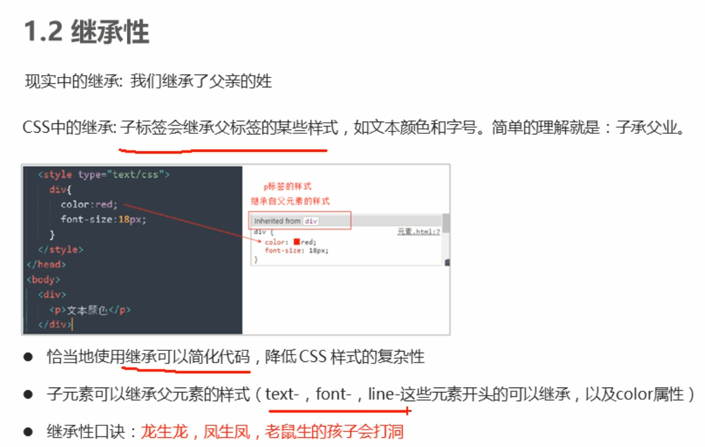

要学习的内容:

- [x] flex布局

plugin：
* open in browser
* js-css-html  formatter
* auto rename tag
* css peek


emmet语法：

`.left+.right`


## 字体

* 垂直居中

  css没有提供垂直居中的代码 [原理](https://www.bilibili.com/video/BV14J4114768?p=114)

  行高和容器高度一致

  ```html
  height: 40px;
  line-height: 40px;
  ```

  


### li

去除 `li`标签的小圆点:  `list-style:none` 


## 第四天

### 行内块元素

> 既能一行放多个，又具有宽和高

img, input, td  它们同时具有块元素和行内元素的特点，称为行内块元素；


行内块元素具有宽和高；**按道理，只有块元素具有宽和高**


==p标签内不允许放div标签==，即 **行内元素**不允许放**块元素**；

a里面可以放块元素


### 元素显示模式的转换

> 一个模式需要另外一种模式的特性


* 转换为块元素：display:block;

* 转换为行元素：display:inline;

* 转换为行内块元素：display:inline-block;

a属于行内元素没有宽度和高度


### 背景

没有特定的顺序，习惯的约定方式为：

background: 背景颜色 背景图片地址 背景平铺 背景图像滚动 背景图片位置


## 第五天


css三个重要特性：层叠性、继承性、优先级

* 层叠性

  相同的选择器设置相同的样式，在样式冲突时

  * ==就近原则==

* 继承性

  子标签会继承父标签

  
  
  颜色和字体相关的都可以继承
  
  font : 12px / 24px ;     文字大小12px，行高24px
  
  font : 12px / 1.5;         行高不跟单位，表示是字体大小的1.5倍
  
  
  
* 优先级
  
  当同一元素指定多个选择器,会有优先级
  
  * 选择器相同，执行层叠性
  * 选择器不同，根据选择器权重执行
  
  
  
  
  
  补充：
  
  * a : hover  ->  0011
  
    a是 0001,  :hover是 0010 
  
  
  
  
  
  父亲的权重很大，但是只要是继承，对于子标签来说权重都是0
  
  ```css
  <style>
          div{
              color: aqua !important;
          }
          .weight{
              color: brown;
          }
          p{
              color:chartreuse;
          }
      </style>
  </head>
  
  <div class="weight">
      <p>权重</p>
  </div>
  ```
  
  此时p标签字体的颜色是 **color:chartreuse;**因为继承的权重是0，即使父标签把color声明为`important`了。
  
  
### 权重叠加

> 来自优先级
>
> 如果是复合选择器，则会有权重叠加，需要计算权重

```css
/* 复合选择器会有权重叠加的问题 */
/* 权重虽然会叠加,但是永远不会有进位 */
/* ul li 权重  0,0,0,1 + 0,0,0,1  =  0,0,0,2     2 */
ul li {
    color: green;
}

/* li 的权重是 0,0,0,1    1 */
li {
    color: red;
}

/* .nav li 后代选择器 权重    0,0,1,0  +  0,0,0,1  =  0,0,1,1    11 */

.nav li {
    color: pink;
}

<ul class="nav">
    <li>大猪蹄子</li>
    <li>大肘子</li>
    <li>猪尾巴</li>
</ul>
```

权重的值在比较时候从左往右比较。权重的叠加，在相同的位置上相加，不会产生进位。


特别注意：

* `.nav li` 的权重是 0011


### 盒子模型


网页布局三大核心：==盒子模型、浮动 和 定位==


边框：border, 内容: content, padding: 内边距, margin: 外边距；


```css
/* border-width 边框的粗细  一般情况下都用 px */
border-width: 5px;
/* border-style 边框的样式  solid 实线边框   dashed 虚线边框  dotted 点线边框*/
border-style: solid;
/* border-style: dashed; */
/* border-style: dotted; */
/* border-color 边框的颜色  */
border-color: pink;
```


简写在border后，没有顺序：

```css
border: 5px solid pink; 
```


边框分开写

```css
/* 上边框 */
border-top: 5px solid pink;
/* 下边框 */
border-bottom: 10px dashed purple;
```


**合并相邻边框**：

如果不合并，相邻边框在一起会使得宽度变宽

```css
border-collapse: collapse;
```


### p142 边框影响盒子实际大小

设置 div 宽和高是200px后，再设置border=10px，那么实际容器的宽和高变为220px。


### p143 盒子模型内边距padding

padding 即边款与内容之间的距离

padding-left, padding-top设置


### p144 padding复合属性


### p145 paddding影响盒子实际大小

和边框一样，会撑大盒子的大小

解决方案：让盒子大小 减去内边距

好处：根据盒子内的内容大小，盒子不设置大小，padding会自动撑开盒子，不会出现某个盒子太小放不下内容的情况


### p149 padding不会撑开盒子的情况

孩子标签的宽度和父标签的宽度一样宽

* 对标签<font color='red'>**不指定宽度不会撑开盒子**</font>，那么即便使用了padding，盒子的宽度也不会增加

  

* 若设置h1的宽度为100%，使用了padding后，盒子的宽度会增加，屏幕放不下，需要滑动滚动条


### margin 

简写方式和padding一样

水平居中：

* 块元素 居中，1. 该盒子必须指定宽度 ； 2. `margin: 0 auto`
* 行元素或行内块元素居中，给父元素添加 `text-align: center`


### 清除内外边距

网页元素很多都带有默认的内外边距，不同浏览器默认也不一致，CSS首先要清楚网页元素的内外边距

```css
* {
	padding : 0;
	margin: 0;
}
```

注意：行内元素为了照顾兼容性 ，尽量只设置左右内外边距，不设置上下内外边距 。但是转为块级和行内块元素就可以了。


### ps的基本操作

pass


### 综合案例 box布局

padding和margin的应用案例


## 第六天

### 圆角

`border-radius`用于外边框圆角，参数可为**数值**或**百分比**

> p165

语法：

```css
border-radius":length;

// 50%是高度和宽度的一半
border-radius":50%;
```

radius 半径

* 画园

  正方形

  border-radius：50%

* 圆角矩形

  border-radius：高度的一半

* 简写属性，

  * (顺时针) 左上角、右上角、右下角、左下角
  * 两个数值，两条对角线

* 分开写：border-top-left-radius, border-top-right-radius


### 盒子阴影

`box-shadow` 为盒子添加阴影


默认是外阴影，不写inset就是外阴影；


### 文字阴影

不是特别重要


 

 
