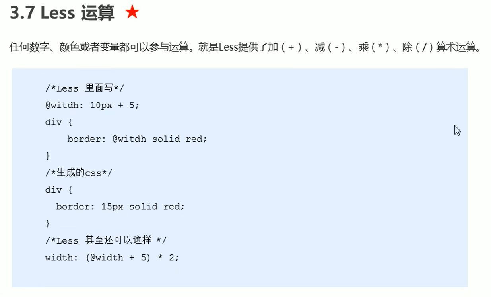
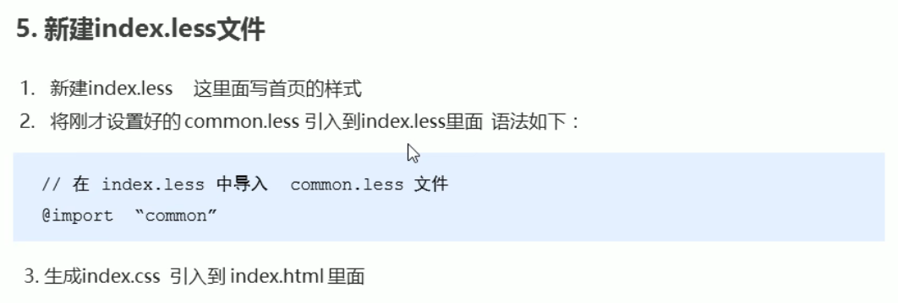

# less基础

为了维护css的弊端


CSS是一门非程序式语言，没有变量、函数、SCOPE(作用域)等概念。

* CSS需要书写大量看似没有逻辑的代码，CSS冗余度是比较高的。
* 不方便维护及扩展，不利于复用；
* CSS没有很好的计算能力
* 非前端工程师，会因为缺少CSS编写经验而很难写出组织良好易于维护的CSS代码项目


Less (leaner Style Sheets) 是CSS扩展语言，也成为CSS预处理器；在现有CSS语法上，加入程序式语言特性。

引入了变量，Mixin(混入)，运算以及函数等功能，大大简化了CSS的编写，并且降低了CSS的维护成本；

less中文网址，http://lesscss.cn


## less变量

变量没有固定的值，可以改变的。CSS的一些颜色和数值等经常使用；

```
@变量名:值;
```

xxx.less

```less
@color: pink;
body{
	background-color: @color;
}
```


需要把less文件，编译成css文件，这样html页面才能使用

vscode Less插件：**Easy LESS**


## Less嵌套写法

```less
#header{
	.logo{
		width: 300px;
	}
}
```


伪类选择器也可以嵌套

若遇见(交集|伪类|伪元素选择器)

* 内层选择器的前面没有&符合，则它被解析为父选择器的后代
* 如果有&符号，它就被解析为父元素自身或父元素的伪类

如果有伪类、交集选择器、 伪元素选择器 我们内层选择器的前面需要加&


`:hover` 没有加  `&`

```less
a{
	color: red;
	:hover{
		color: blue;
	}
}
```

生成的css为

```css
.logo a :hover {
  width: 100px;
}

```

`:hover`前多了一个空格 ，表示`:hover`是a的后代


`:hover` 加上  `&`

```
a{
	color: red;
	&:hover{
		color: blue;
	}
}
```

生成的css为:

```css
.logo a:hover {
  width: 100px;
}
```

此时是`a:hover`，而不是原先的`a :hover`


若要添加before伪元素 

```
.nav::before{

}
```




运算符的左右两侧必须敲**一个空格**隔开；

两个数参与运算第2个数的单位可以不写；

若两个参与运算的数的单位不一样，以第一个数的单位为准；


## 样式文件导入

[参考](https://www.bilibili.com/video/BV14J4114768?p=455)

```
// 首页的样式less文件
@import "common";
// @import 导入的意思 可以把一个样式文件导入到另外一个样式文件里面
// link 是把一个 样式文件引入到 html页面里面
```


