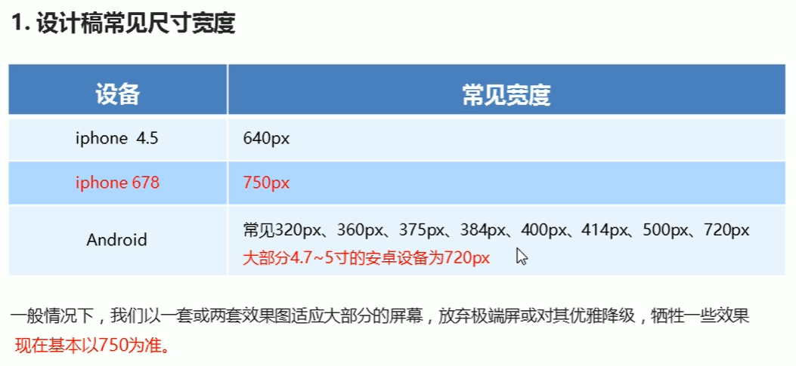
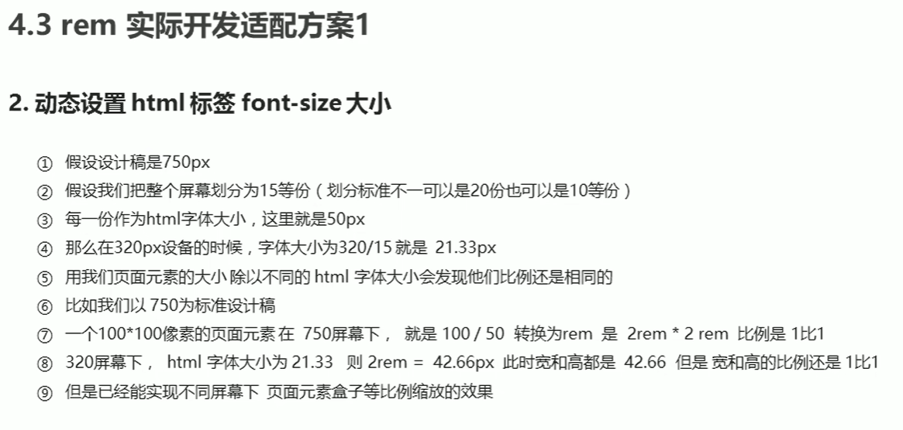

# rem适配方案

1. 让一些不能等比自适应的元素，达到当设备尺寸发生变化的时候，等比例适配当前设备；
2. 使用媒体查询根据不同设备按比例设置html的字体大小，然后页面元素使用rem做尺寸单位，当html字体大小变化元素尺寸也会发生变化，从而达到等比缩放的适配；

## rem适配方案(市场主流)

技术方案1

* less
* 媒体查询
* rem

技术方案2(**推荐**)

* flexible.js
* rem

总结：

1. 两种方案现在都存在
2. 方案2更简单，现阶段无需了解里面的js代码

## 方案1

