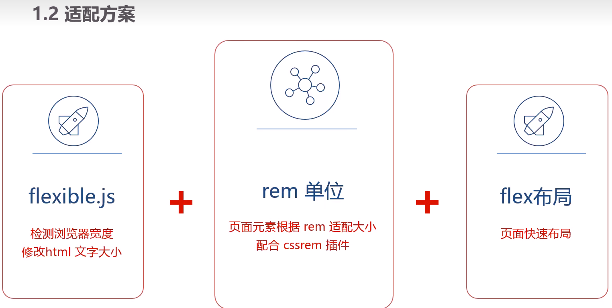
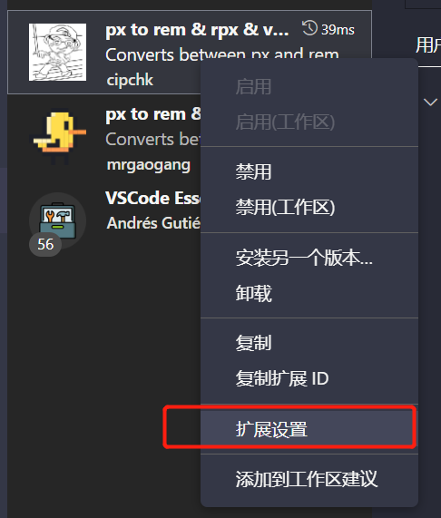
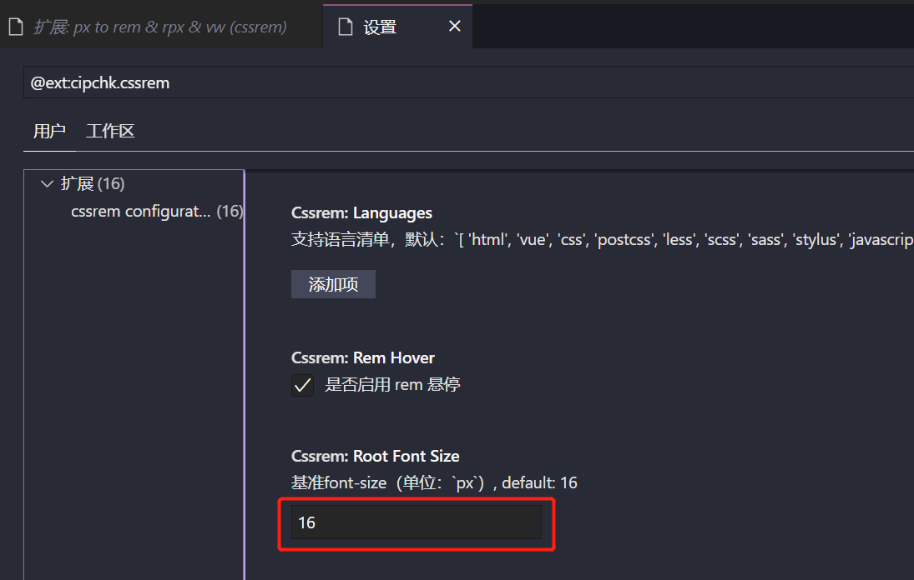
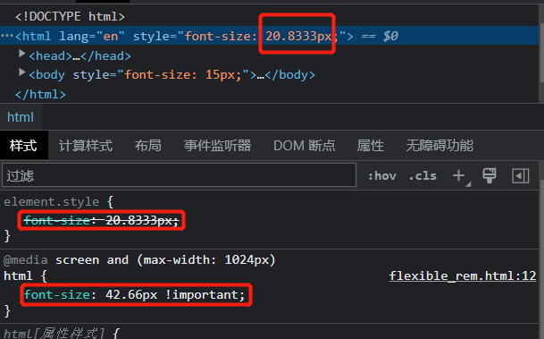

# 控制台




## cssrem插件 

作者: cipchk

插件别名：px to rem & rpx & v..


修改cssrem插件的基准值






修改 flexible.js

```js
// set 1rem = viewWidth / 10
function setRemUnit() {
    var rem = docEl.clientWidth / 20
    docEl.style.fontSize = rem + 'px'
}
```


`docEl.clientWidth / 20`, 表示rem把屏幕划分为20等分；


## 适配方案

要把屏幕宽度约束在1024~1920之间

如果屏幕尺寸小于1024不要再缩放了，如果大于1920也不要再缩放了

> 使用媒体查询实现

```css
@media screen and (max-width: 1024px) {
    html {
    	font-size: 42.66px !important;
    }
}

@media screen and (min-width: 1920px) {
    html {
    	font-size: 80px !important;
    }
}
```

当屏幕变小时，~~20.8333px~~，而是42.66px。




🔖https://www.bilibili.com/video/BV1Sy4y1C7ha?p=457&vd_source=eba6ee187d1992efba9a9a4dc2cc9321

