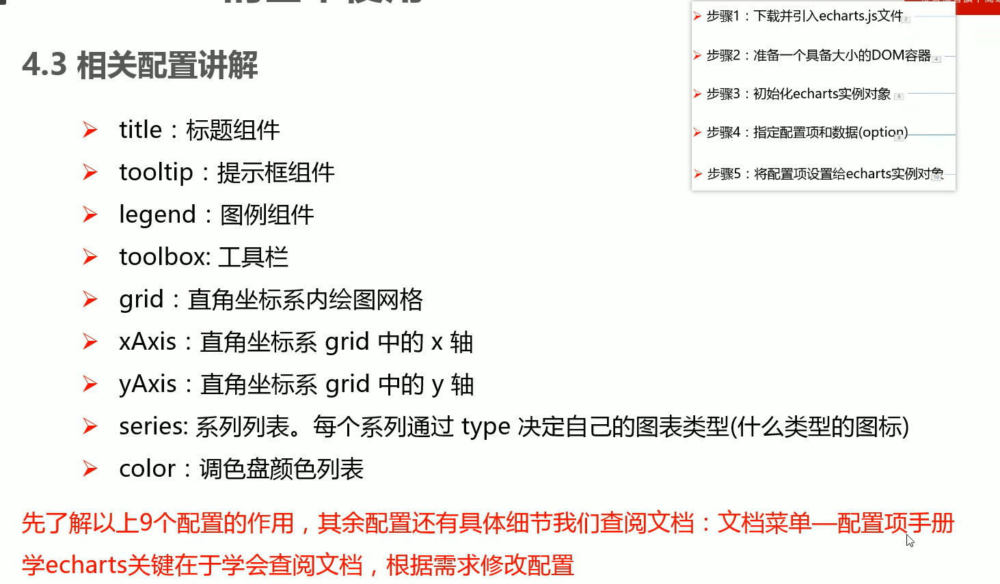

# echarts

https://echarts.apache.org/

## 步骤

1. 下载并引入`echarts.js`文件

   图标依赖这个库

2. 准备一个具备大小的DOM容器

   生成的图表会放入这个容器内

3. 初始化echarts实例对象

   实例化echarts对象

4. 指定配置项和数据

   根据具体需求修改配置选项

5. 将配置项设置给echarts实例对象

   让echarts对象根据修改好的配置生效





## 折线图

### 更改线的颜色

```js
color:['','','','','']
```

